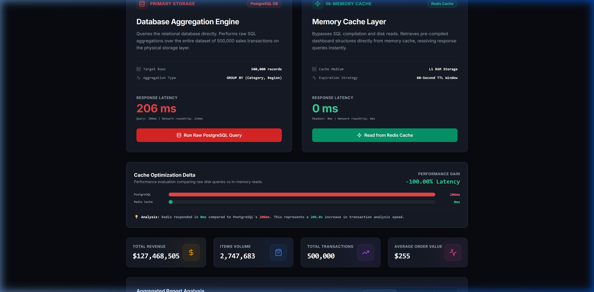
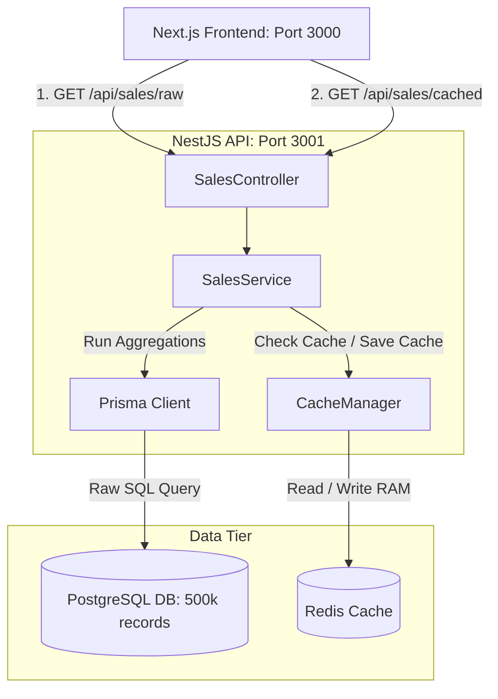

# NestJS Redis Benchmark Demo

[](https://nextjs.org/)
[](https://nestjs.com/)
[](https://www.postgresql.org/)
[](https://redis.io/)
[](https://www.docker.com/)

> **A visual performance benchmark demonstrating the power of Redis caching vs PostgreSQL raw queries on 500,000 sales records.**



---

## 🎯 Project Overview (วัตถุประสงค์ของโปรเจกต์)

โปรเจกต์นี้สร้างขึ้นเพื่อท้าพิสูจน์และเปรียบเทียบประสิทธิภาพการดึงรายงานข้อมูลยอดขายขนาดใหญ่จำนวน **500,000 แถว** ระหว่างการคิวรีสดจาก **PostgreSQL (Raw SQL Group By)** กับการดึงข้อมูลจากหน่วยความจำด้วย **Redis Caching** ผ่านแดชบอร์ดหน้าบ้านที่ออกแบบมาให้มีความสปอร์ตและสะท้อนความเร็วในการโหลดข้อมูลอย่างชัดเจน (Data-driven Single-Page Arena)

---

## ⚙️ System Architecture (สถาปัตยกรรมระบบ)



---

## ⚡ Quick Start (ติดตั้งและรันในคำสั่งเดียว)

โปรเจกต์นี้ได้รับการคอนฟิกให้พร้อมทำงานแบบอัตโนมัติทั้งหมดผ่าน **Docker Compose** ผู้ใช้สามารถกดรันระบบทุกอย่าง (รวมทั้งการสร้างตารางและ Seed ข้อมูลยอดขาย 500,000 รายการ) ได้ด้วยคำสั่งเดียว:

```bash
# รันโปรเจกต์แบบ Background
docker compose up --build -d
```

หลังจากตู้คอนเทนเนอร์ทำงานเสร็จสมบูรณ์ สามารถเข้าใช้งานหน้าต่างแดชบอร์ดทดสอบได้ที่:
* **Frontend Arena (Dashboard)**: [http://localhost:3000](http://localhost:3000)
* **Backend API (API Specs)**: [http://localhost:3001/api](http://localhost:3001/api)

*(หมายเหตุ: ในครั้งแรกที่รัน Container ตัว Backend script จะทำการรอ Database บูตตัวเสร็จ จากนั้นจะสั่ง Run DB Push เพื่อสร้าง Index และรัน Script Seed ข้อมูลจำลองจำนวน 500,000 แถวโดยอัตโนมัติ ซึ่งอาจจะใช้เวลาประมาณ 10-15 วินาทีในการเตรียมข้อมูลก่อน API พร้อมทำงาน)*

---

## 📜 The Ironclad Directives (กฎเหล็กประจำโปรเจกต์)

เพื่อให้โค้ดโปรเจกต์นี้คงคุณภาพระดับ Production-Grade บน GitHub เรายึดมั่นในกฎเกณฑ์การพัฒนาต่อไปนี้อย่างเคร่งครัด:

### 1. Seamless Deployment (การติดตั้งที่ไร้รอยต่อ)
* ทุกส่วนบริการเชื่อมกันด้วย `docker-compose.yml` ประกอบด้วย 4 คอนเทนเนอร์หลัก (`frontend`, `backend`, `postgres`, `redis`) ไม่จำเป็นต้องติดตั้ง DB หรือ dependencies ใดๆ บนเครื่อง Client ภายนอก Docker

### 2. Zero Technical Debt (ไร้หนี้ทางเทคนิค)
* **TypeScript Strict Mode**: ปิดการใช้งานตัวแปรประเภท `any` แบบ 100% มีการกำหนด Type ที่ชัดเจนให้กับทุกอ็อบเจกต์
* **Linting & Formatting**: ควบคุมด้วย ESLint และ Prettier ในระดับที่เข้มข้นที่สุด จัดหน้าตาของโค้ดให้เหมือนผู้เขียนคนเดียวกันเขียน
* **Husky (Pre-commit Hooks)**: หากตรวจพบว่าโค้ดมี Linting Warning หรือมีบั๊กประเภท syntax/typing จะปฏิเสธการ Commit ข้อมูลขึ้น Git ทันที

### 3. Clean Architecture (สถาปัตยกรรมที่ชัดเจน)
* **NestJS Backend**: แยกชั้นควบคุม Request (`SalesController`) และชั้นคำนวณ Business Logic (`SalesService`) ออกจากกันโดยเด็ดขาด 
* **Next.js Frontend**: แยกโฟลเดอร์ Component ออกมาอย่างชัดเจน (`Header`, `Arena`, `StatCard`, `BenchmarkChart`) หลีกเลี่ยงการสุมโค้ดทั้งหมดไว้ในไฟล์หน้าหลัก `page.tsx`

### 4. High Performance (การรีดประสิทธิภาพสูงสุด)
* **Prisma Indexing**: โชว์การเขียน Schema Migration เพื่อทำ Indexing คอลัมน์ที่ถูกหยิบมารายงานบ่อย เช่น `category`, `soldAt`, และ `region` เพื่อลดคอขวดบนฐานข้อมูล
* **Cache Manager with Redis**: เชื่อมต่อ Cache ในระดับ Layer เพื่อลด Overhead ของ Database ในข้อมูลที่มีอัตราการเปลี่ยนแปลงคงที่

### 5. Security First (ความปลอดภัยระดับมาตรฐาน)
* **HTTP Headers protection**: ใช้ไลบรารี `helmet` เพื่อตั้งค่าความปลอดภัยของ Headers ป้องกันภัยคุกคามพื้นฐาน
* **Rate Limiting**: ติดตั้ง `@nestjs/throttler` ป้องกันการโจมตีประเภท DDoS และ API Brute-force (เช่น จำกัดการกดยิง API ถี่ๆ)

---

## 📊 Database Optimization & Indexing
ในส่วนของฐานข้อมูล `Sale` ได้ถูกออกแบบให้ทำ **Database Indexing** บนคอลัมน์สำคัญที่ถูกเรียกใช้งานเพื่อจัดกลุ่ม (`GROUP BY`) และเรียงลำดับ (`ORDER BY`) ดังนี้:

```prisma
model Sale {
  id          String   @id @default(uuid())
  productName String
  category    String
  amount      Float
  quantity    Int
  soldAt      DateTime
  region      String

  @@index([category]) // ทำ Index สำหรับกรอง/จัดกลุ่มตามหมวดหมู่สินค้า
  @@index([soldAt])   // ทำ Index สำหรับจัดช่วงเวลารายงานรายเดือน
  @@index([region])   // ทำ Index สำหรับกรองข้อมูลรายภูมิภาค
}
```
การทำ Indexing นี้ช่วยเร่งความเร็วในการคิวรีเชิงวิเคราะห์ของ PostgreSQL จากวินาทีกว่าๆ ให้เหลือเพียงหลักร้อยมิลลิวินาที แต่อย่างไรก็ตาม เมื่อชนกับ **Redis (In-Memory)** ที่มีอัตราตอบสนองระดับ **sub-millisecond (< 5ms)** ก็ยังเห็นความต่างทางประสิทธิภาพอย่างมีนัยสำคัญ
